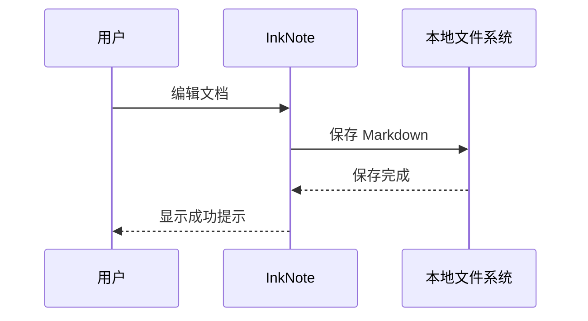

# InkNote 使用指南

InkNote 是一款本地优先、所见即所得的跨平台 Markdown 编辑器。文档始终以标准 Markdown 格式保存在本地，可在 Windows、macOS 与 Linux 上使用。

[项目主页](https://github.com/likehao19/InkNote) · [版本下载](https://github.com/likehao19/InkNote/releases) · [问题反馈](https://github.com/likehao19/InkNote/issues)

---

## 1. 开始使用

### 1.1 创建与打开文档

通过首页或“文件”菜单可以新建文档、打开 Markdown 文件以及添加工作区文件夹。使用系统文件关联打开文档时，InkNote 默认进入预览状态，避免意外修改原文件。

### 1.2 工作区

左侧文件树支持多个根目录，并保留文件夹的展开状态。单击文件夹进行选择，双击文件夹或点击箭头展开与折叠；右键根目录可以将其从工作区移除，该操作不会删除本地文件。

### 1.3 编辑与预览

- **预览状态**：呈现最终 Markdown 排版，适合阅读与检查。
- **编辑状态**：点击正文或组件即可修改内容。
- **源码模式**：使用 `Ctrl+/`（macOS 为 `⌘/`）查看完整 Markdown 源码。

---

## 2. 文本格式

InkNote 支持 **粗体**、*斜体*、***粗斜体***、~~删除线~~、`行内代码`、==高亮==、<u>下划线</u>、上标 X<sup>2</sup> 与下标 H<sub>2</sub>O。

> 写作时专注于内容，Markdown 语法只在需要编辑时出现。

链接可以指向[仓库文档](https://github.com/likehao19/InkNote/blob/main/README.md)，也可以使用自动链接：<https://github.com/likehao19/InkNote>。

---

## 3. 列表与任务

### 无序列表

- 本地 Markdown 文件
- 所见即所得编辑
  - 标题与段落
  - 表格与代码块
  - 公式与图表
- HTML 与 PDF 导出

### 有序列表

1. 打开或创建 Markdown 文档
2. 在实时预览中完成写作
3. 保存源文件
4. 按需导出 HTML 或 PDF

### 任务列表

- [x] 创建工作区
- [x] 完成文档结构
- [ ] 补充发布说明
  - [x] 核对版本号
  - [ ] 发布最终文档
- [ ] 归档历史材料

---

## 4. 功能支持

| 组件 | 状态 | 用途 |
| :--- | :---: | ---: |
| 实时预览 | 已支持 | 文档写作与阅读 |
| 表格编辑 | 已支持 | 结构化信息整理 |
| 代码块 | 已支持 | 技术文档与示例 |
| 数学公式 | 已支持 | 科学与工程内容 |
| Mermaid 图表 | 已支持 | 流程与架构说明 |
| HTML / PDF 导出 | 已支持 | 文档交付与分享 |

表格支持单元格选择、行列增删以及左对齐、居中和右对齐。以下是项目发布计划：

| 阶段 | 负责人 | 完成时间 | 状态 |
| --- | --- | :---: | :---: |
| 需求确认 | 产品组 | 2026-08-18 | 已完成 |
| 功能验证 | 测试组 | 2026-08-22 | 已完成 |
| 文档发布 | 文档组 | 2026-08-24 | 进行中 |

---

## 5. 代码块

代码块提供语法高亮、行号、复制按钮与独立横向滚动。

```typescript
type DocumentStatus = "draft" | "review" | "published";

interface DocumentInfo {
  title: string;
  status: DocumentStatus;
  updatedAt: string;
}

const releaseNote: DocumentInfo = {
  title: "InkNote Release Notes",
  status: "published",
  updatedAt: "2026-08-24",
};
```

```rust
fn reading_time(words: usize) -> usize {
    let minutes = words.div_ceil(400);
    minutes.max(1)
}
```

```bash
pnpm install
pnpm test
pnpm tauri build
```

---

## 6. 数学公式

行内公式适合在段落中表达简短内容，例如质能方程 $E = mc^2$。

块级公式适合独立展示：

$$
int_{-infty}^{infty} e^{-x^2} \, dx = sqrt{pi}
$$

$$
egin{aligned}
S_n &= \frac{n(a_1 + a_n)}{2} \\
a_n &= a_1 + (n - 1)d
end{aligned}
$$

---

## 7. Mermaid 图表




---

## 8. 文档检索

按 `Ctrl+F`（macOS 为 `⌘F`）查找或替换当前文档内容；按 `Ctrl+Shift+F`（macOS 为 `⌘⇧F`）检索当前工作区的文件名与文件内容。点击结果后，文件树会自动展开并定位到对应行。

---

## 9. 导出与交付

InkNote 可以直接导出 HTML 与 PDF：

1. 保存当前 Markdown 文档。
2. 从“文件”菜单选择导出格式。
3. 指定目标位置。
4. 在导出的文件中检查标题、表格、公式与图表。

导出内容会应用当前 Markdown 主题，并保留适合阅读和打印的排版。

---

## 10. 常用快捷键

| 功能 | Windows / Linux | macOS |
| --- | --- | --- |
| 新建文档 | `Ctrl+N` | `⌘N` |
| 打开文件 | `Ctrl+O` | `⌘O` |
| 保存 | `Ctrl+S` | `⌘S` |
| 查找 / 替换 | `Ctrl+F` / `Ctrl+H` | `⌘F` / `⌘H` |
| 工作区检索 | `Ctrl+Shift+F` | `⌘⇧F` |
| 源码 / 实时预览 | `Ctrl+/` | `⌘/` |
| 专注模式 | `F8` | `F8` |
| 打字机模式 | `F9` | `F9` |

---

## 11. 本地数据与更新

InkNote 不要求账号，也不会上传文档。工作区、最近文件与偏好设置保存在系统应用数据目录的 `settings.json` 中。通过“帮助 → 检查更新”可以获取 GitHub Releases 中发布的最新版本。

---

*InkNote — 为专注的 Markdown 写作而设计。*
