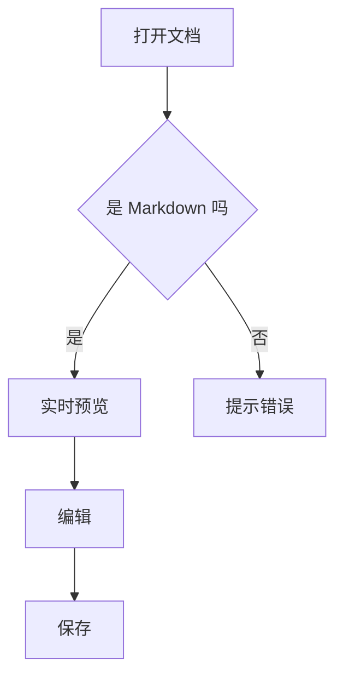
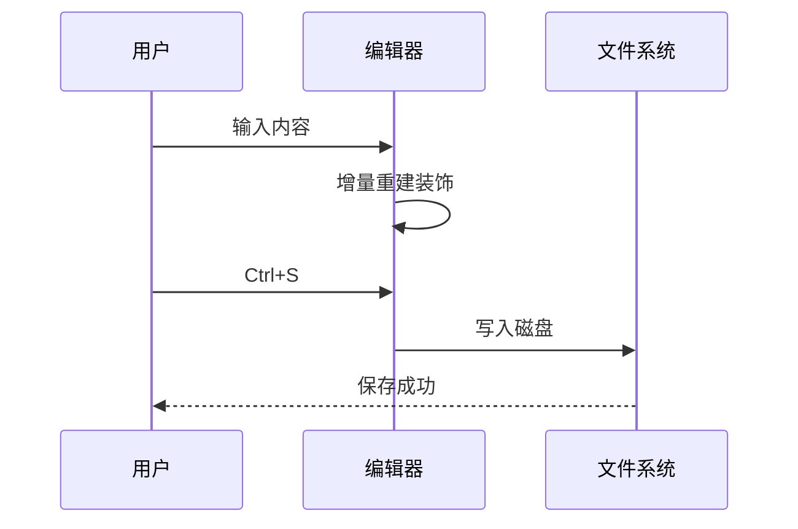

# MDNote 组件总览

这份文档把编辑器支持的**所有组件**和**已修问题的回归用例**放在一起，方便一次过验收。
建议从上往下逐节点一遍，遇到「✅ 应该」就是预期行为。

---

## 一、标题体系

# 一级标题
## 二级标题
### 三级标题
#### 四级标题
##### 五级标题
###### 六级标题

Setext 一级标题
===============

Setext 二级标题
---------------

> ✅ 应该：光标点进任意标题行，前面的 `#` 会显形；移开又消失。左侧大纲里 **不应该** 出现 `tags: demo, 测试` 这种假标题。
> ✅ 应该：顶部的 front matter 显示成一个虚线框，**可以直接点进去改** YAML，改完点别处即生效。

---

## 二、行内格式

**粗体**、*斜体*、***粗斜体***、~~删除线~~、`行内代码`、==高亮==、<u>下划线</u>、上标 X<sup>2</sup>、下标 H<sub>2</sub>O。

普通段落里混排：这段有 **粗体** 和 `代码` 还有 ==高亮==，字之间不应该出现莫名其妙的空隙。

> ✅ 应该：把光标移到 `粗体` 两个字**中间**，`**` 会显形；移到别处又收起来。
> ✅ 应该：`==高亮==`、`<u>`、`<sup>`、`<sub>` 在预览里直接看到效果，而不是看到原始标记。

---

## 三、链接与图片

行内链接：[MDNote 项目主页](https://example.com/mdnote/docs/getting-started)

自动链接：<https://example.com>

长链接混在段落里：请参考 [这份很长的文档](https://example.com/a/very/long/path/that/would/leave/a/huge/gap) 里的说明，链接后面**不应该**跟着一大片空白。

块级图片：


行内图片：状态  正常，这句话应该完整地排在一行里。

图片加载失败的样子：


> ✅ 应该：**普通点击链接是定位光标**，按住 Ctrl（macOS 是 Cmd）再点才打开浏览器；按住 Ctrl 时鼠标指针变成手型。
> ✅ 应该：行内图片不会把所在段落从中间劈成两段。
> ✅ 应该：**单击块级图片是选中它**（出现蓝色描边），不会把 `` 源码翻出来；**双击**打开图片对话框改路径；选中后按 Backspace 整张删掉。

---

## 四、引用

> 一级引用：左侧有竖线，`>` 标记本身不占位。
>
> > 二级嵌套引用。
>
> 引用里也能有 **粗体**、`代码` 和 [链接](https://example.com)。

---

## 五、列表

### 无序列表

- 第一项
- 第二项
  - 嵌套第二层
    - 嵌套第三层
- 第三项

### 有序列表

1. 第一步
2. 第二步
   1. 子步骤 A
   2. 子步骤 B
3. 第三步

### 任务列表

- [x] 已完成的任务（应该显示为**打勾 + 删除线 + 灰色**）
- [ ] 未完成的任务
- [ ] 点一下左边的方框可以切换状态
  - [x] 嵌套的已完成项
  - [ ] 嵌套的未完成项

1. [ ] 有序形式的任务项也要能点

> ✅ 应该：选中多行后点「无序列表」，**每一行**都会加上标记，且嵌套项的缩进不被拉平。

---

## 六、分割线

---

***

___

> ✅ 应该：分割线点一下是**选中**（出现描边），按 Backspace 删掉整条；按 ↓ 或 Esc 回到正文。不会把 `---` 源码翻出来。

---

## 七、代码块

```javascript
// JavaScript
function greet(name) {
  const msg = `Hello, ${name}!`;
  console.log(msg);
  return msg;
}
```

```python
# Python
def fib(n: int) -> int:
    a, b = 0, 1
    for _ in range(n):
        a, b = b, a + b
    return a
```

```rust
// Rust
fn main() {
    let items = vec![1, 2, 3];
    println!("{:?}", items.iter().sum::<i32>());
}
```

```sql
SELECT id, name FROM users WHERE active = 1 ORDER BY name;
```

```json
{ "name": "md-note", "version": "0.1.0" }
```

```bash
pnpm install && pnpm tauri dev
```

无语言标注的代码块：

```
纯文本，没有语法高亮
第二行
```

代码块里的这些**不应该**被当成 Markdown 解析：

```text
**这不是粗体**  $不是公式$  | 不是 | 表格 |  ==不是高亮==
```

### 代码块交互清单（重点）

- **在空行输入 ` ```java ` 然后回车 → 立刻变成一个 java 代码块，光标已在里面**（`$$` 回车同理，出公式块）
- 点代码块**任意位置**（包括右侧留白、行号栏）都能直接开始打字，**看不到 ` ``` ` 围栏**
- 左侧有**行号**，随输入实时增减
- 右上角悬停出现**语言下拉**（切换后立即换配色）与**复制**按钮；静止时工具条隐藏，代码块是干净的一块
- 打字时语法高亮实时跟着变，光标不会乱跳
- 聚焦时**不该出现任何蓝色描边/焦点框**
- Tab 插入缩进，不会跳走焦点
- Esc 或在末尾按 ↓ 退出到下方正文；在开头按 ↑ 退出到上方
- 内容清空后再按一次 Backspace，整个代码块被删掉
- 中文输入法在代码块里连续打字不能丢字；Ctrl+S 能保存、Ctrl+Z 能撤销

---

## 八、数学公式

行内公式：质能方程 $E = mc^2$，勾股定理 $a^2 + b^2 = c^2$。

块级公式：

$$
\int_{-\infty}^{\infty} e^{-x^2} \, dx = \sqrt{\pi}
$$

$$
\begin{aligned}
f(x) &= a x^2 + b x + c \\
f'(x) &= 2 a x + b
\end{aligned}
$$

### 金额回归用例（重点）

价格 $5 到 $10 元不等，套餐 $99，会员价 $88 起。

这批货成本 $1200，售价 $1999，利润 $799。

转义写法：\$100 和 \$200。

> ✅ 应该：上面三段里的数字**全部是普通文字**，不能有任何一段被渲染成数学公式。
> ✅ 应该：点击块级公式会在上方展开 LaTeX 编辑区，边改边看渲染结果；Esc 退出，失焦收起编辑区。

---

## 九、Mermaid 图表





> ✅ 应该：在**本文档最上方**随便敲几个字，这两张图**不应该**跟着闪一下重绘。
> ✅ 应该：点击图表会在上方展开源码编辑区，停手约 0.4 秒后图自动重绘；Esc 退出。

---

## 十、表格

### 基础表格

| 组件 | 状态 | 说明 |
| --- | --- | --- |
| 实时预览 | 可用 | 标记随光标显隐 |
| 表格编辑 | 可用 | 单元格可直接改 |
| 导出 | 可用 | HTML / PDF |

### 对齐方式

| 左对齐 | 居中 | 右对齐 |
| :--- | :---: | ---: |
| left | center | right |
| 一 | 二 | 三 |

### 单元格里的行内 Markdown（重点）

| 语法 | 效果 | 备注 |
| --- | --- | --- |
| 粗体 | **加粗文字** | 应显示为粗体 |
| 斜体 | *倾斜文字* | 应显示为斜体 |
| 代码 | `npm run dev` | 应有灰底 |
| 删除线 | ~~作废~~ | 应有横线 |
| 高亮 | ==重点== | 应有底色 |
| 链接 | [文档](https://example.com) | 应为强调色 |

> ✅ 应该：上表右列显示的是**渲染后的效果**，不是 `**加粗文字**` 这样的原始标记。
> ✅ 应该：点进任意单元格后变回源码文本可编辑，移开焦点又变回渲染态，且内容不丢标记。

### 残缺行与转义竖线

| A | B | C |
| --- | --- | --- |
| 只有两列 | 缺一列 |
| 含转义 \| 竖线 | 正常 | 正常 |
| 1 | 2 | 3 |

> ✅ 应该：第二行会被自动补齐成三列；Tab 键在单元格之间跳转不会串位。

### 表格交互清单

- Tab / Shift+Tab：下一格 / 上一格
- ↑ / ↓：上下行同列
- Enter：下一行；在最后一行则新增一行
- Esc：退出表格回到正文
- 首格 Backspace / 末格 Delete：跳出表格
- 悬停表格出现工具栏：增删行列、三种对齐、删除整表
- Ctrl+S 在单元格里也要能保存；Ctrl+Z 要能撤销
- 中文输入法在单元格里连续打字不能丢字

---

## 十一、脚注

这句话有一个脚注[^1]，这句话还有另一个[^note]。

[^1]: 第一个脚注的内容。
[^note]: 命名脚注也支持。

---

## 十二、输入体验回归用例（重点）

把光标放到本节末尾的空行，**逐个手动输入**下面这些内容，检查有没有多出字符：

| 输入 | ✅ 应该得到 | ❌ 不应该得到 |
| --- | --- | --- |
| 先按 `(` 再按 `)` | `()` | `())` |
| `don't` | `don't` | `don't'` |
| `2 * 3` | `2 * 3` | `2 ** 3` |
| `snake_case` | `snake_case` | `snake_case_` |
| 选中一个词后按 `*` | `*词*` | 词被替换掉 |
| 列表项行尾按回车 | 自动续下一个列表项 | 只换行不续标记 |

（在这行下面练手：）


---

## 十三、快捷键速查

| 快捷键 | 功能 |
| --- | --- |
| `Ctrl+/` | 源码 / 预览切换 |
| `Ctrl+S` / `Ctrl+Shift+S` | 保存 / 另存为 |
| `Ctrl+B` / `Ctrl+I` | 粗体 / 斜体 |
| `Ctrl+K` | 插入链接 |
| `Ctrl+1`~`Ctrl+6` / `Ctrl+0` | 设为标题 / 正文 |
| `Ctrl+Shift+8` / `Ctrl+Shift+7` | 无序 / 有序列表 |
| `Ctrl+Shift+X` | 任务列表 |
| `Ctrl+Shift+Q` | 引用 |
| `Ctrl+Shift+K` / `Ctrl+Shift+M` | 代码块 / 公式块 |
| `Ctrl+T` | 插入表格 |
| `Ctrl+F` / `Ctrl+H` | 查找 / 替换 |
| `Ctrl+P` / `Ctrl+Shift+F` | 快速打开 / 全局搜索 |
| `F8` / `F9` | 专注模式 / 打字机模式 |
| `F11` | 全屏 |

> ✅ 应该：焦点在编辑器里时按 `Ctrl+/` 能真正切到源码模式（按一次切一次，不是原地不动）。
> ✅ 应该：按 `F9` 开打字机模式后继续打字，当前行会保持在屏幕垂直居中，控制台不报 `CodeMirror plugin crashed`。

---

## 十四、长文压力段

下面这段用来观察大文档下的输入手感。按住方向键快速上下移动光标，或在文档开头连续输入，应当没有明显卡顿。

> ✅ 应该（**点击定位专项**）：从这里往上，随便点文档里的任何一行——光标必须落在**你点的那一行**。
> 尤其检查经过多个分割线 / 代码块 / 表格 / 图片之后的段落：如果光标总是落到下一行、且越往下偏得越多，
> 说明块级组件的高度测量又出问题了（块根元素只能用 padding，不能用 margin）。

MDNote 采用「源码之上叠装饰」的实时预览方案：编辑期用 Lezer 增量语法树标出各类节点，把标记符号替换掉、把代码块与表格换成组件；光标进入某个节点范围时装饰自动撤销，露出原始 Markdown。装饰集拆成静态层与可见层两级——静态层只在文档变化时重建，移动光标只做一次范围受限的过滤，因此上下移动光标的开销与文档长度无关。导出走的是另一条链路，用 remark / rehype 生成完整 AST，再输出 HTML 或交给系统打印为 PDF，Mermaid 在导出时直接渲染成内联 SVG，导出的文件离线也能正常打开。

---

## 十五、边界情况

行尾两个空格造成的硬换行：
第一行  
第二行

HTML 实体：&amp; &lt; &gt; &copy;

转义字符：\*不是斜体\* \_不是斜体\_ \`不是代码\` \# 不是标题

空的行内代码：`` ` `` 与相邻的 `代码`。

---

*文档结束 —— 如果以上每一条都符合预期，说明这一轮修复到位了。*
