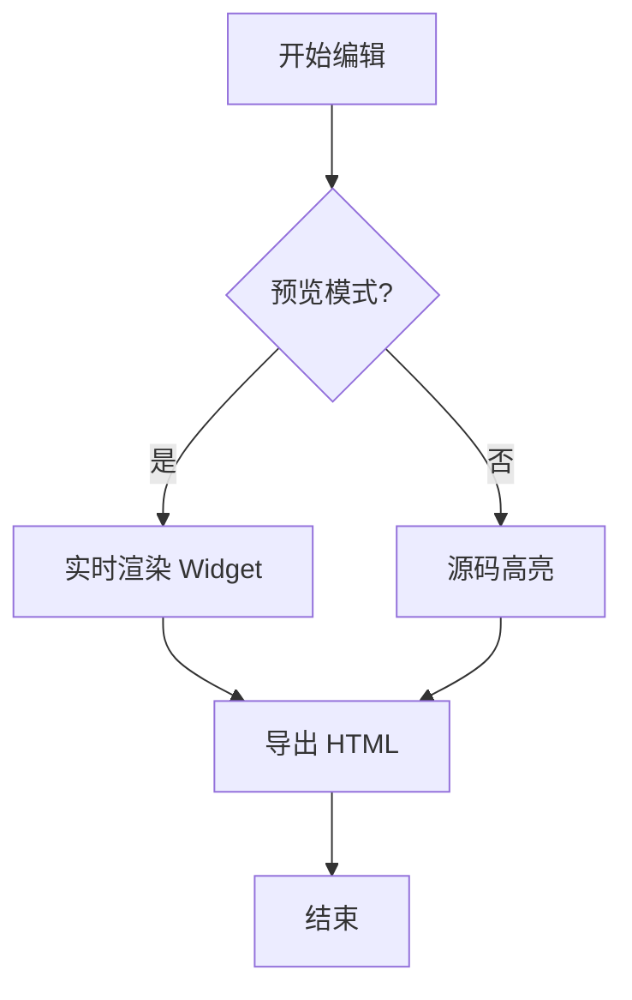
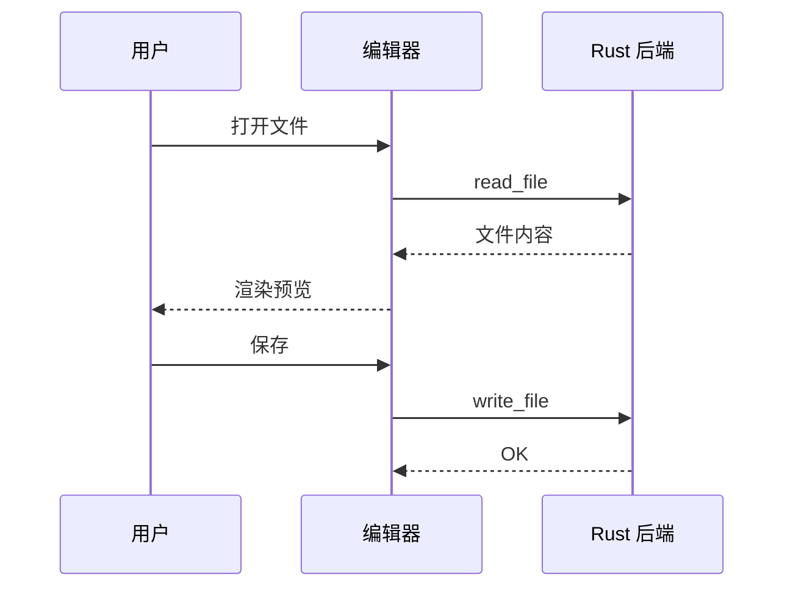

# MDNote 语法全覆盖测试

> 本文档用于测试 MDNote 的各项 Markdown 渲染与编辑能力。建议分别在**实时预览**与**源码模式**下打开，并逐项检查大纲、字数统计、表格工具栏、列表对齐、引用样式等是否正常。

这是一段普通正文。MDNote 基于 **Tauri 2** + **CodeMirror 6** 构建，追求类 Typora 的书写体验。下面按模块依次展开，覆盖标题、行内格式、列表、引用、代码、表格、数学公式、Mermaid 图表、脚注等。

中英文混排测试：The quick brown fox jumps over the lazy dog. 敏捷的棕色狐狸跳过懒狗。数字 2026、符号 α+β=γ、以及邮箱 autolink@example.com 与 URL <https://github.com> 的识别效果也应正常。

---

## 一级章节：标题体系

### 三级标题示例

#### 四级标题示例

##### 五级标题示例

###### 六级标题示例

回到正文段落。六级标题之后继续书写，检查标题层级在大纲侧栏中的折叠与跳转是否正常。

---

## 行内格式

**这是粗体文字**，*这是斜体文字*，***这是粗斜体***。

~~这是删除线文字~~，使用 GFM 双波浪线 ~~另一种删除线~~ 也应生效。

`这是行内代码`，例如 `const answer = 42;` 与 `npm run tauri dev`。

==这是高亮标记==（MDNote 使用 `==高亮==` 语法）。

组合样式：**粗体中的 *斜体* 与 `代码`**，以及 ==高亮里的 **加粗**==。

转义字符：\*这不是斜体\*，\|这不是表格分隔符\|。

---

## 链接与图片

[MDNote 项目主页](https://github.com) 是标准 Markdown 链接。

[带标题的链接](https://example.com "悬停标题示例")

自动链接：<https://www.markdownguide.org> 与 <mailto:test@example.com>

相对路径图片（若同目录无图则显示占位，主要测试语法解析）：


---

## 引用块

> 这是一级引用。引用的竖线应与正文左缘对齐，引用文字向右缩进。
>
> 引用中可以包含 **粗体**、*斜体* 与 `行内代码`。
>
> > 这是嵌套引用第二层。
> >
> > > 这是嵌套引用第三层，检查多层引用的缩进与颜色。

引用结束后回到普通段落。

---

## 无序列表

- 第一项：苹果
- 第二项：香蕉
- 第三项：橙子
  - 嵌套 3.1：葡萄
  - 嵌套 3.2：草莓
    - 更深层 3.2.1：蓝莓
    - 更深层 3.2.2：树莓
- 第四项：西瓜

使用 `*` 与 `+` 的变体：

* 星号列表 A
* 星号列表 B

+ 加号列表 A
+ 加号列表 B

---

## 有序列表

1. 第一步：准备环境
2. 第二步：安装依赖
3. 第三步：启动开发服务器
   1. 嵌套有序 3.1
   2. 嵌套有序 3.2
      1. 更深层 3.2.1
      2. 更深层 3.2.2
4. 第四步：打开本测试文档
5. 第五步：逐项核对渲染结果

---

## 任务列表

- [ ] 未完成任务：检查无序列表标记左对齐
- [x] 已完成任务：检查预览模式
- [ ] 未完成任务：测试表格增删行列
- [X] 已完成任务：测试导出 HTML（大写 X）
- [ ] 嵌套任务示例
  - [ ] 子任务 A
  - [x] 子任务 B

---

## 水平分割线

上方内容。

---

下方内容。分割线应渲染为可视化横线 Widget。

---

## 代码块

### JavaScript / TypeScript

```javascript
/**
 * 斐波那契数列（测试语法高亮）
 */
function fibonacci(n) {
  if (n <= 1) return n;
  let a = 0, b = 1;
  for (let i = 2; i <= n; i++) {
    [a, b] = [b, a + b];
  }
  return b;
}

console.log(fibonacci(10)); // 55
```

```typescript
interface EditorTab {
  id: string;
  path: string | null;
  content: string;
  dirty: boolean;
}

const greet = (name: string): string => `Hello, ${name}!`;
```

### Python

```python
from dataclasses import dataclass
from typing import List

@dataclass
class Note:
    title: str
    body: str
    tags: List[str]

def word_count(text: str) -> int:
    return len(text.split())

if __name__ == "__main__":
    note = Note("测试", "内容", ["md", "test"])
    print(note)
```

### Rust

```rust
fn merge_sorted(a: &[i32], b: &[i32]) -> Vec<i32> {
    let mut out = Vec::with_capacity(a.len() + b.len());
    let (mut i, mut j) = (0, 0);
    while i < a.len() && j < b.len() {
        if a[i] <= b[j] {
            out.push(a[i]);
            i += 1;
        } else {
            out.push(b[j]);
            j += 1;
        }
    }
    out.extend_from_slice(&a[i..]);
    out.extend_from_slice(&b[j..]);
    out
}
```

### SQL

```sql
SELECT u.id, u.name, COUNT(p.id) AS post_count
FROM users u
LEFT JOIN posts p ON p.user_id = u.id
WHERE u.active = TRUE
GROUP BY u.id, u.name
HAVING COUNT(p.id) > 5
ORDER BY post_count DESC
LIMIT 20;
```

### Bash / JSON

```bash
#!/usr/bin/env bash
set -euo pipefail
pnpm install
pnpm tauri dev
```

```json
{
  "name": "md-note",
  "version": "0.1.0",
  "features": ["preview", "source", "export-html", "i18n"]
}
```

### 无语言标注的代码块

```
纯文本代码块
用于测试默认样式
第三行
```

---

## 表格

### 基础表格（左对齐默认）

| 姓名 | 部门 | 入职年份 | 备注 |
| --- | --- | --- | --- |
| 张三 | 研发 | 2020 | 全栈 |
| 李四 | 设计 | 2021 | UI/UX |
| 王五 | 产品 | 2019 | 负责人 |
| 赵六 | 测试 | 2022 | QA |

### 列对齐测试

| 左对齐 | 居中对齐 | 右对齐 | 数字 |
| :--- | :---: | ---: | ---: |
| Apple | 苹果 | ¥6.00 | 100 |
| Banana | 香蕉 | ¥3.50 | 250 |
| Cherry | 樱桃 | ¥12.00 | 80 |
| Durian | 榴莲 | ¥88.00 | 12 |

### 宽表与特殊字符

| 列 A | 列 B | 列 C | 列 D | 列 E |
| --- | --- | --- | --- | --- |
| 含管道符转义 \| 的单元格 | 空单元格留空 | **粗体** | *斜体* | `code` |
| 中文一二三四五 | English | 混合 Mixed | 2026-08-18 | ✅ |

> 在预览模式下点击表格，应显示工具栏占位（无跳动），并可增删行列、调整对齐、删除表格。

---

## 数学公式

### 行内公式

欧拉公式 $e^{i\pi} + 1 = 0$ 被誉为最美的数学公式之一。

勾股定理 $a^2 + b^2 = c^2$，二次方程求根公式 $x = \frac{-b \pm \sqrt{b^2-4ac}}{2a}$。

### 块级公式

$$
\int_{-\infty}^{\infty} e^{-x^2}\, dx = \sqrt{\pi}
$$

$$
\begin{aligned}
\nabla \times \vec{E} &= -\frac{\partial \vec{B}}{\partial t} \\
\nabla \times \vec{B} &= \mu_0 \vec{J} + \mu_0 \varepsilon_0 \frac{\partial \vec{E}}{\partial t}
\end{aligned}
$$

矩阵示例：

$$
\mathbf{A} = \begin{pmatrix}
1 & 2 & 3 \\
4 & 5 & 6 \\
7 & 8 & 9
\end{pmatrix}
$$

---

## Mermaid 图表

### 流程图



### 序列图



---

## 脚注

MDNote 支持脚注引用语法[^footnote-demo]。

也可以多次引用同一脚注[^footnote-demo]。

另一则脚注说明 GFM 表格与任务列表的兼容性[^gfm-note]。

[^footnote-demo]: 这是脚注正文。脚注引用在预览中应有特殊样式标记 `[ ^ label ]`。
[^gfm-note]: GitHub Flavored Markdown 扩展了表格、删除线、任务列表等语法，本编辑器基于 remark-gfm 解析。

---

## 长段落压力测试（字数统计）

下面三段用于测试中文字数、英文单词数与阅读时间估算。第一段以中文为主：

 Markdown 是一种轻量级标记语言，由约翰·格鲁伯于 2004 年创建，旨在让人们使用易读易写的纯文本格式编写文档，再转换成有效的 HTML。与传统富文本编辑器不同，Markdown 的源文件可以直接用任何文本编辑器打开，也非常适合版本控制系统追踪变更。近年来，Obsidian、Typora、Notion 等工具推动了「所见即所得」或「即时渲染」的书写体验，让 Markdown 从程序员的 README 专属格式，变成了知识管理、技术写作和日常笔记的主流选择。MDNote 正是在这一背景下诞生的桌面端方案：它保留 Markdown 的开放性与可移植性，同时通过 Tauri 获得原生窗口、文件系统访问与更小的资源占用。

第二段以英文为主：

 Markdown is a lightweight markup language that you can use to add formatting elements to plaintext text documents. Created by John Gruber in 2004, Markdown is now one of the world's most popular markup languages. Using Markdown is different than using a word processor. In an application like Microsoft Word, you format text with the click of a button. Markdown enables you to write structured documents using punctuation and characters that are familiar to anyone who has ever used email or chat applications. When you write in Markdown, the syntax is preserved in the source file, which means your notes remain portable across editors and platforms.

第三段中英混合，并包含数字与标点：

 2026 年的笔记软件市场竞争激烈。Users expect **instant preview**, **low latency**, and **native file access**. 一款合格的编辑器需要处理好：长文档性能（Performance）、数学公式（KaTeX）、代码高亮（highlight.js）、以及国际化（i18n）——这些正是 MDNote 持续迭代的方向。如果你正在阅读这一段，说明滚动、选区、状态栏字数与大纲跳转均工作正常。

---

## 大纲锚点测试

### 锚点 A：短章节

简短内容。

### 锚点 B：中等章节

中等长度内容，用于测试大纲中高亮当前标题行。

### 锚点 C：嵌套结构

#### 锚点 C.1

#### 锚点 C.2

##### 锚点 C.2.1

深层标题，检查大纲缩进层级。

---

## 边界情况速查

| 测试项 | 输入 | 期望 |
| --- | --- | --- |
| 空链接 | [空](https://example.com) | 正常渲染 |
| 强调嵌套 | **a *b* c** | 嵌套样式 |
| 硬换行 | 行末两空格测试（下一行应紧贴） | 视解析器而定 |
| HTML 实体 | &copy; 2026 | 导出时转义 |

单独一行的 `---` 不应被误识别为 YAML 结束符（本文 front matter 已在文首闭合）。

---

## 结语

若以上各节在预览模式下显示正确、源码模式可编辑、表格可操作、导出 HTML 离线可用，则 MDNote 核心语法链路基本通过验收。

**测试清单：**

1. [ ] Front Matter 摘要 Widget
2. [ ] 六级标题与大纲同步
3. [ ] 列表标记左缘对齐
4. [ ] 引用竖线对齐
5. [ ] 表格工具栏无布局跳动
6. [ ] KaTeX 公式渲染
7. [ ] Mermaid 图表渲染
8. [ ] 字数统计（中英文混合）
9. [ ] 导出 HTML
10. [ ] 失焦自动保存（若已开启）

---

*文档结束 — 祝测试顺利！*
