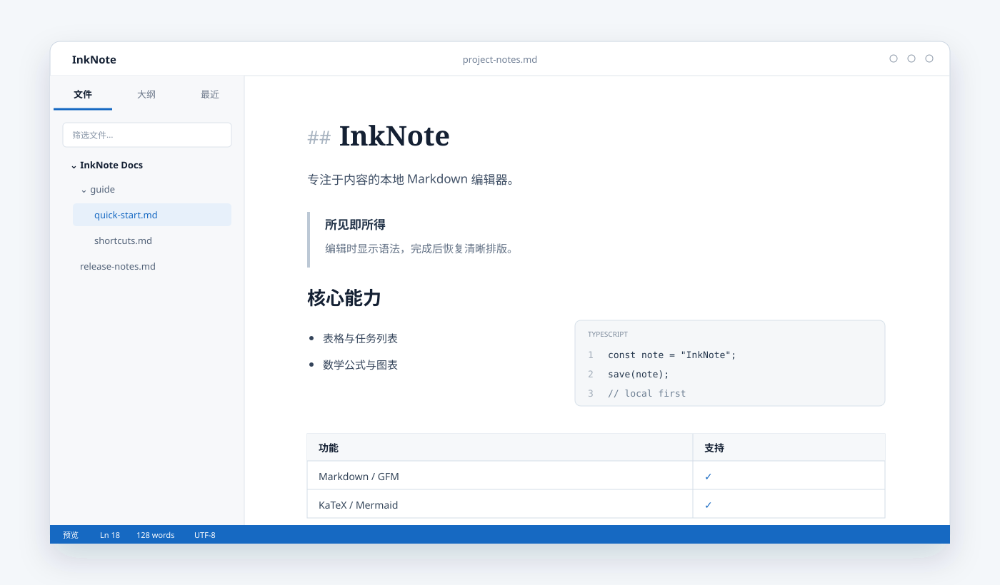

# 墨笺 InkNote

一款本地优先、所见即所得的跨平台 Markdown 编辑器。InkNote 使用 Tauri 2、React 与 CodeMirror 6 构建，源文件始终保持为标准 Markdown。

[官方网站](https://likehao19.github.io/InkNote/) · [下载最新版本](https://github.com/likehao19/InkNote/releases/latest) · [问题反馈](https://github.com/likehao19/InkNote/issues)



## 下载

| 平台 | 安装包 | 架构 |
| --- | --- | --- |
| Windows | [EXE 安装程序](https://github.com/likehao19/InkNote/releases/latest/download/InkNote_0.2.1_x64-setup.exe) | x64 |
| macOS | [DMG 镜像](https://github.com/likehao19/InkNote/releases/latest/download/InkNote_0.2.1_universal.dmg) | Intel / Apple 芯片 |
| Linux | [AppImage](https://github.com/likehao19/InkNote/releases/latest/download/InkNote_0.2.1_amd64.AppImage) | x86_64 |

其他格式（MSI、DEB）与历史版本可在 [Releases](https://github.com/likehao19/InkNote/releases) 页面获取。应用内的“检查更新”会读取最新 Release，并在有新版本时下载和安装更新。

## 主要功能

- 所见即所得的无缝实时预览：点击内容进行编辑，离开焦点后恢复排版
- 完整 Markdown / GFM 支持：标题、列表、引用、表格、任务列表、脚注等
- 代码块编辑、语法高亮、行号、语言选择与独立横向滚动
- KaTeX 数学公式与 Mermaid 图表
- 多根目录工作区、文件树折叠状态、大纲与最近文件
- 当前文档查找替换与工作区全文检索
- 预览 / 编辑、源码 / 实时预览、专注与打字机模式
- 导出 HTML 与 PDF
- 亮色 / 暗色界面、Markdown 组件主题、自定义 CSS
- 中英文界面与 Windows、macOS、Linux 快捷键适配
- 系统文件关联与应用内自动更新

## 常用快捷键

| 功能 | Windows / Linux | macOS |
| --- | --- | --- |
| 新建文档 | `Ctrl+N` | `⌘N` |
| 打开文件 | `Ctrl+O` | `⌘O` |
| 保存 | `Ctrl+S` | `⌘S` |
| 当前文档查找 / 替换 | `Ctrl+F` | `⌘F` |
| 工作区搜索 | `Ctrl+Shift+F` | `⌘⇧F` |
| 快速打开 | `Ctrl+P` | `⌘P` |
| 源码 / 实时预览 | `Ctrl+/` | `⌘/` |
| 切换侧边栏 | `Ctrl+Shift+L` | `⌘⇧L` |
| 设置 | `Ctrl+,` | `⌘,` |
| 专注模式 | `F8` | `F8` |
| 打字机模式 | `F9` | `F9` |

完整列表可在 InkNote 的“帮助 → 快捷键”中查看。

## 本地数据

InkNote 不要求账号，也不上传文档。Markdown 文件保存在用户选择的位置；工作区、最近文件与偏好设置保存在应用配置目录的 `settings.json` 中。实际位置遵循各系统的应用数据目录规范。

## 开发

### 环境要求

- Node.js LTS 与 pnpm
- Rust stable
- 对应平台的 [Tauri 2 系统依赖](https://v2.tauri.app/start/prerequisites/)

### 启动

```bash
cd InkNote
pnpm install
pnpm tauri dev
```

### 验证与构建

```bash
cd InkNote
pnpm test
pnpm build
pnpm tauri build
```

## 目录结构

```text
InkNote/
├─ .github/workflows/   # 持续集成、发布与官网部署
├─ docs/                # 官方网站（GitHub Pages）
├─ InkNote/
│  ├─ src/              # React 界面与编辑器
│  ├─ src-tauri/        # Tauri / Rust 桌面端
│  └─ public/           # 应用静态资源
└─ README.md
```

## 技术栈

- Tauri 2 / Rust
- React 19 / TypeScript / Vite
- CodeMirror 6
- unified / remark / rehype
- KaTeX / Mermaid / highlight.js

## 参与贡献

欢迎通过 [Issues](https://github.com/likehao19/InkNote/issues) 提交可复现的问题或功能建议。提交代码前请先运行测试与前端构建，并保持改动聚焦。

---

## English

InkNote is a local-first, WYSIWYG Markdown editor for Windows, macOS, and Linux. It keeps one standard Markdown source file while providing seamless live preview, direct component editing, workspace search, HTML/PDF export, themes, and in-app updates.

- [Official website](https://likehao19.github.io/InkNote/)
- [Latest release](https://github.com/likehao19/InkNote/releases/latest)
- [Issue tracker](https://github.com/likehao19/InkNote/issues)

### Development

Install Node.js LTS, pnpm, Rust stable, and the Tauri 2 platform prerequisites, then run:

```bash
cd InkNote
pnpm install
pnpm tauri dev
```

Use `pnpm test`, `pnpm build`, and `pnpm tauri build` to verify and package the application.

## License

Copyright © likehao19. All rights reserved unless a separate license is added to this repository.
