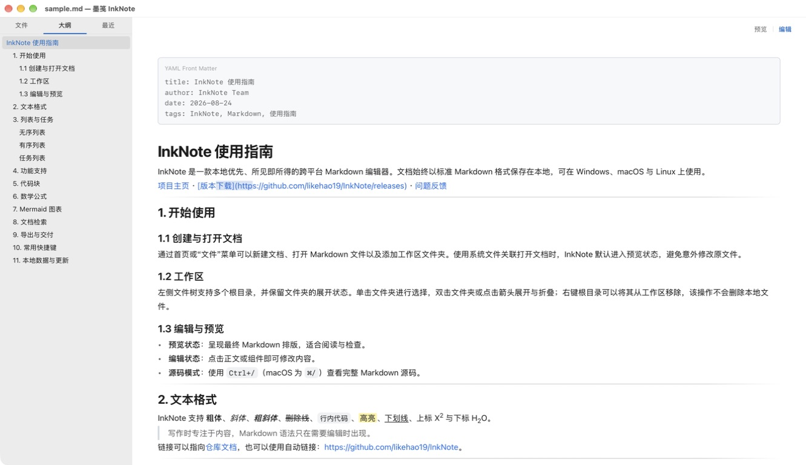
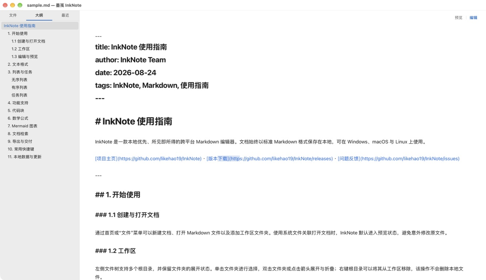

<h1 align="center">墨笺 InkNote</h1>

<p align="center"><strong>本地优先，像写普通文档一样写 Markdown。</strong></p>

<p align="center">
  <a href="README.md">English</a> |
  简体中文 |
  <a href="README.zh-TW.md">繁體中文</a> |
  <a href="README.ja.md">日本語</a> |
  <a href="README.ko.md">한국어</a>
</p>

<p align="center">
  <a href="https://github.com/likehao19/InkNote/releases/latest"></a>
  <a href="https://github.com/likehao19/InkNote/actions/workflows/ci.yml"></a>
  <a href="https://github.com/likehao19/InkNote/releases"></a>
  <a href="https://github.com/likehao19/InkNote/stargazers"></a>
  <a href="LICENSE"></a>
</p>

<p align="center">
  <a href="https://likehao19.github.io/InkNote/">官方网站</a> ·
  <a href="https://github.com/likehao19/InkNote/releases/latest">下载</a> ·
  <a href="https://github.com/likehao19/InkNote/issues">问题反馈</a>
</p>

<p align="center">
  
</p>

## 保留 Markdown 文件，减少 Markdown 的干扰

InkNote 始终以标准 Markdown 文件保存文档，同时提供接近普通文档编辑器的写作体验。输入时直接看到排版结果，复杂内容块可以原位编辑，需要时也能随时切换到完整源码。

- **本地优先**：无需账号，不强制使用云服务，也不会上传文档。
- **格式开放**：笔记始终是普通 `.md` 文件，可由任何 Markdown 工具读取。
- **安心打开**：新建和已有文档都会显示清晰的 **预览 / 编辑** 访问开关，避免误改文件。
- **面向真实文档**：大纲、工作区、检索、导出、公式、图表、表格和代码都属于完整工作流。

## 两种写作方式

<table>
  <tr>
    <td width="50%"></td>
    <td width="50%"></td>
  </tr>
  <tr>
    <td align="center"><strong>实时预览或完整源码</strong><br />在排版后的内容中写作，或直接检查和编辑完整 Markdown 源码。</td>
    <td align="center"><strong>按自己的方式使用</strong><br />选择亮色、暗色或跟随系统，以及 Markdown 主题、排版和自定义 CSS。</td>
  </tr>
</table>

## InkNote 能做什么

### 写作与排版

- 实时预览编辑，仅在需要时显示 Markdown 标记。
- 支持标题、列表、引用、链接、图片、任务列表、脚注和 GFM 表格。
- 支持粗体、斜体、删除线、高亮、行内代码、下划线、上标和下标。
- 提供专注模式与打字机模式，减少写作干扰。

### 技术内容

- 带语法高亮、行号和复制按钮的代码块。
- KaTeX 行内公式与块级公式。
- Mermaid 流程图、时序图及其他支持的图表。
- 表格、代码、公式、图表、图片和 YAML front matter 均可原位编辑。

### 组织与检索

- 多工作区目录、文件树状态保留以及常用文件操作。
- 文档大纲、最近文件和快速打开。
- 当前文档查找与替换。
- 跨工作区检索文件名和文件内容，并可直接跳转到结果。

### 导出与个性化

- 将完整文档导出为独立 HTML 或 PDF。
- 亮色、暗色和跟随系统的界面外观。
- GitHub、Vue、极简 Markdown 主题，以及自定义 CSS。
- Markdown 文件关联、拖放打开和应用内更新检查。
- 应用界面支持简体中文和英文。

## 下载

| 平台 | 安装包 | 架构 |
| --- | --- | --- |
| Windows | [下载安装程序](https://github.com/likehao19/InkNote/releases/latest/download/InkNote-Windows-x64-Setup.exe) | x64 |
| macOS | [下载 Apple 芯片版](https://github.com/likehao19/InkNote/releases/latest/download/InkNote-macOS-arm64.dmg) | ARM64 |
| macOS | [下载 Intel 版](https://github.com/likehao19/InkNote/releases/latest/download/InkNote-macOS-x86_64.dmg) | x86_64 |

更新说明和历史版本可在 [GitHub Releases](https://github.com/likehao19/InkNote/releases) 查看。

## 安装

### Windows

下载 `InkNote-Windows-x64-Setup.exe` 并按照安装程序提示操作。当前 Windows 版本支持 x64 系统。

### macOS

根据 Mac 处理器下载对应 DMG，打开后将 **InkNote** 拖入 **应用程序** 文件夹。

项目目前没有使用付费 Apple Developer 证书，因此安装包采用 ad-hoc 签名。如果 Gatekeeper 在首次启动时拦截，请打开 **系统设置 → 隐私与安全性**，选择 **仍要打开**。如果 macOS 仍提示应用已损坏，请执行：

```bash
xattr -dr com.apple.quarantine /Applications/InkNote.app
```

该命令只会移除下载应用的隔离属性，不会修改你的文档。

## 常用快捷键

| 功能 | Windows | macOS |
| --- | --- | --- |
| 新建文档 | `Ctrl+N` | `⌘N` |
| 打开文件 | `Ctrl+O` | `⌘O` |
| 保存 | `Ctrl+S` | `⌘S` |
| 查找 / 替换 | `Ctrl+F` | `⌘F` |
| 工作区检索 | `Ctrl+Shift+F` | `⌘⇧F` |
| 快速打开 | `Ctrl+P` | `⌘P` |
| 实时预览 / 源码 | `Ctrl+/` | `⌘/` |
| 切换侧边栏 | `Ctrl+Shift+L` | `⌘⇧L` |
| 设置 | `Ctrl+,` | `⌘,` |
| 专注模式 | `F8` | `F8` |
| 打字机模式 | `F9` | `F9` |

在 InkNote 中打开 **帮助 → 快捷键** 可查看完整列表。

## 隐私与本地数据

InkNote 不要求登录，也不会上传文档。文件保存在你选择的位置；工作区目录、最近文件和偏好设置会以 `settings.json` 的形式保存在系统对应的应用数据目录中。

## 从源码构建

### 环境要求

- Node.js LTS 与 pnpm
- Rust stable
- [Tauri 2 平台依赖](https://v2.tauri.app/start/prerequisites/)

```bash
git clone https://github.com/likehao19/InkNote.git
cd InkNote/InkNote
pnpm install
pnpm tauri dev
```

运行项目检查并构建桌面安装包：

```bash
pnpm test
pnpm build
cargo check --all-targets --manifest-path src-tauri/Cargo.toml
pnpm tauri build
```

## 技术栈

InkNote 使用 Tauri 2 与 Rust、React 19 与 TypeScript、CodeMirror 6、unified/remark/rehype、KaTeX、Mermaid 和 highlight.js 构建。

## 参与贡献

欢迎通过 [GitHub Issues](https://github.com/likehao19/InkNote/issues) 提交可复现的问题或聚焦的功能建议。提交代码前，请运行上述前端测试、生产构建和 Rust 检查。

社区交流：[LinuxDo](https://linux.do)

## 贡献者

<table>
  <tr>
    <td align="center">
      <a href="https://github.com/likehao19">
        <br />
        <sub><strong>likehao19</strong></sub>
      </a>
    </td>
    <td align="center">
      <a href="https://github.com/StackTao">
        <br />
        <sub><strong>StackTao</strong></sub>
      </a>
    </td>
  </tr>
</table>

## 开源协议

InkNote 基于 [MIT 许可证](LICENSE) 开源。
